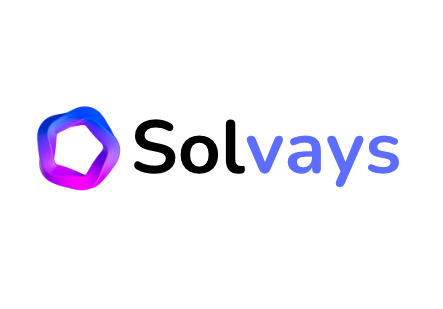

    

Solvays
---

### Inspiration
The inspiration for Solvays came from the growing trend of companies seeking direct feedback from their customers about new product launches. We wanted to provide a platform for users to share their thoughts and opinions, while also incentivizing them for their time and effort through the use of cryptocurrency rewards.

### What it does
Solvays is a mobile app that allows users to provide feedback on new product launches through custom survays. Each completed survey earns the user Solana micro rewards, creating a mutually beneficial relationship between the user and the company seeking their feedback.

<!--

How we built it
Solvays was built using the SurveyKit library and integrated with the Solana network through the Solana Mobile Stack SDK. This allowed us to create a seamless experience for users to complete survays and receive their rewards in real-time.

Challenges we ran into
One of the biggest challenges we faced was integrating the Solana network into the app. However, by utilizing the Solana Mobile Stack SDK, we were able to overcome this challenge and ensure smooth transactions for the users.

Accomplishments that we're proud of
We are proud to have created a platform that not only incentivizes users for their valuable feedback but also allows companies to receive direct, actionable insights from their customers.

What we learned
Through the development of Solvays, we learned the importance of seamless integration and user experience in a cryptocurrency-based app. We also learned about the potential for cryptocurrency rewards to drive engagement and participation in survays.

What's next for Solvays?
In the future, we plan to expand Solvays to include a wider range of survey types and industries. We also hope to add new features to enhance the user experience and make it even more rewarding for our users.
-->

